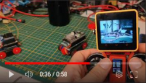
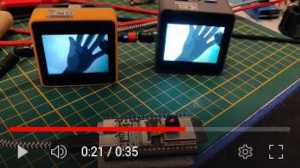
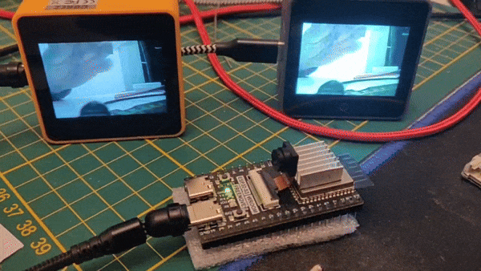

# ESPNowCam - Data streamer

[](https://github.com/hpsaturn/esp32s3-cam/actions/)   

The ESPNowCam library is a simple and direct video or data streamer designed for popular ESP32 devices, utilizing the ESPNow protocol. No need for IPs, routers, or credentials—keeping it straightforward and hassle-free! :D

**This library is for general purpose**, as it accepts pointers to various types of data, including buffers, strings, images, or any byte-formatted content. This flexibility enables transmission of larger packages across different scenarios, not limited to cameras alone. For instance, a buffer of 4000 bytes takes approximately 1/9 of a second to transmit, resulting in a frame rate of around 9FPS.

<table>
  <tr>
    <td>
      Don't forget to star ⭐ this repository
    </td>
  </tr>
</table>

## Performance

The current version tested with the next cameras:

| Sender |  Frame | JPGQ | FPS | Status |
|:-----------------|:-------:|:-----:|:------:|:------:|
| TTGO TJournal |  QVGA | 12 | ~11 FPS | STABLE |
| Freenove S3 | QVGA | 12 | ~10 FPS | STABLE |
| Freenove S3 | HVGA | 12 | ~6 FPS | STABLE |
| M5CoreS3 | QVGA | 12  | ~11 FPS | STABLE |
| M5UnitCamS3 | QVGA | 12 | ~9 FPS | STABLE |
| XIAO ESP32S3 | QVGA | 12 | ~9 FPS | STABLE |

[Full list of senders and receivers devices supported](#supported-devices)

## Library installation

**PlatformIO**:

Add the following line to the lib_deps option of your [env:] section:

```python
hpsaturn/EspNowCam@^0.1.10
```

Or via command line:  

```python
pio pkg install --library "hpsaturn/ESPNowCam@^0.1.7"
```

**Arduino IDE**:

For `Arduino IDE` is a little bit more complicated because the Arduino IDE dependencies resolver is very bad, but you only need:

1. Download and install the [Nanopb library](https://github.com/nanopb/nanopb/releases/tag/nanopb-0.4.8) using the `Include Library` section via zip file
2. and then with the **Library Manager** find **ESPNowCam** and install it.  

Note: Nanobp is not included as a dependency because, despite being 25 years after the invention of symbolic links, Arduino IDE does not support these types of files. Consider exploring PlatformIO for your future developments, as it offers a more versatile and modern development environment.

## Usage

**To send** any kind of data, you only need a buffer and the size to send:

```cpp
ESPNowCam radio;

radio.init();
radio.sendData(out_jpg, out_jpg_len);
```

**To receive** the data, you only need to define a buffer and callback:

```cpp
radio.setRecvBuffer(fb);
radio.setRecvCallback(onDataReady);
radio.init();
```

```cpp
void onDataReady(uint32_t lenght) {
  tft.drawJpg(fb, lenght , 0, 0, dw, dh);
}
```

It is also possible to define a specific target:

```cpp
uint8_t macRecv[6] = {0xB8,0xF0,0x09,0xC6,0x0E,0xCC};
radio.setTarget(macRecv);
radio.init();
```

**Predefined drivers:**

The library includes some pre-defined camera configs to have an easy implementation, for example:

```cpp
#include <ESPNowCam.h>
#include <drivers/CamFreenove.h>

CamFreenove Camera;
```

and you able to change the Camera parameters, e.g:

```cpp
Camera.config.fb_count = 2;
Camera.config.frame_size = FRAMESIZE_QQVGA;
```

For now, it includes drivers for FreenoveS3, XIAOS3, M5UnitCamS3, and the TTGO T-Journal cameras, but you are able to define your custom camera like is shown in the [custom-camera-sender](examples/custom-camera-sender/) example. If you can run it in a different camera, please notify me :D

**Multi camera mode:**

Is possible too configure multiple cameras or senders to only one receiver, N:1 mode, configuring filters by MAC in the receiver:

```cpp
radio.setRecvFilter(fb_camera1, camera1, onCamera1DataReady);
radio.setRecvFilter(fb_camera2, camera2, onCamera2DataReady);
radio.setRecvFilter(fb_camera3, camera3, onCamera3DataReady);
```

and each camera should have configured the receiver MAC like a target. Fore more details, please follow the [multi-camera-one-receiver](https://github.com/hpsaturn/ESPNowCam/tree/master/examples/multi-camera-one-receiver/) directory example.

## Examples

[](https://youtu.be/nhLr7XEUdfU) [](https://youtu.be/zXIzP1TGlpA)  
[[Tank Video]](https://youtu.be/nhLr7XEUdfU) [[Broadcasting Video]](https://youtu.be/zXIzP1TGlpA)

### Transmiter Camera samples

| ENV Name   |    Details      | Frame|   Status |
|:-----------------|:--------------:|:----------:|:----------:|
| freenove-basic-sender  | PSRAM, 2FB, JPG | QVGA | STABLE |
| freenove-hvga-sender  | PSRAM, 2FB, JPG | HVGA | <6 FPS |
| freenove-nojpg-sender  | PSRAM, 2FB, NOJPG | QVGA | <2FPS |
| xiao-espnow-sender  |  PSRAM, 2FB, JPG | QVGA | STABLE |
| xiao-fpv-sender  | POWER ON/OFF, PSRAM, 2FB, JPG | QVGA | STABLE |
| unitcams3 | PSRAM, 2FB, JPG | QVGA | TESTING |
| custom-camera-sender | Custom settings - optional PSRAM | QVGA | STABLE |
| tjournal-espnow-sender  | NOPSRAM, 1FB, internal JPG | QVGA | STABLE |
| m5cores3-espnow-sender | PSRAM, 2FB, JPG built-in camera | QVGA | STABLE |
| | | | |

### Receivers samples

| ENV Name   |    Details      |   Status |
|:-----------------|:--------------:|:----------:|
| m5core2-basic-receiver | Video receiver [1] |  STABLE |
| m5core2-espnow-receiver | Video receiver [1] |  STABLE |
| m5cores3-espnow-receiver | Video receiver [1] |  STABLE|
| makerfabs-basic-receiver | Video receiver [1] [2] |  STABLE |  
| makerfabs-nojpg-receiver | Video receiver [1] [2] | <2FPS |
| tft-3.5-basic-receiver | Any TFT display with LGFX [1] | STABLE |
| | | |

[1] Use with any sender sample  
[2] Use with freenove HVGA sender sample for example.

### Advanced samples

| ENV Name   |    Details      | Frame|   Status |
|:-----------------|:--------------:|:----------:|:----------:|
| xiao-fpv-sender  | POWER ON/OFF, PSRAM, 2FB, JPG | QVGA | STABLE |
| freenove-tank | sender and custom payload receiver | QVGA | TESTING |
| m5stickCplus-joystick-tank | custom payload - Telemetry | -- | TESTING |  
| makerfabs-multi-receiver | N:1 mode, muti camera one receiver | -- | TESTING |  
| m5cores3-camera1 | One target only for multi-receiver sample | QVGA | TESTING |  
| tjournal-camera2 | One target only for multi-receiver sample | QQVGA | TESTING |  
| xiao-camera3 | One target only for multi-receiver sample | QQVGA | TESTING |  
| | | | |

## Running samples

For install and run these tests, first install [PlatformIO](http://platformio.org/) open source ecosystem for IoT development compatible with **Arduino** IDE and its command line tools (Windows, MacOs and Linux). Also, you may need to install [git](http://git-scm.com/) in your system.

For compile and install each sample, only choose one of them envs names in the table, and run the next command in the root of this project, like this:

```bash
pio run -e m5cores3-espnow-receiver --target upload
```

Some examples, *.ino samples, only needs run `pio run --target upload` into each directory

## Transmitter and Receiver modes

The last version has many improvements, and right now is very stable. For now, it supports one transmitter and multiple receivers in real time using broadcast, also P2P connections using MAC address, and multi camera mode with one receiver.

[](https://youtu.be/zXIzP1TGlpA)  
[[1:N mode]](https://youtu.be/zXIzP1TGlpA)

## Troubleshooting

The **Freenove camera** sometimes needs good power cable and also takes some seconds to stabilization, that means, that not worries for initial video glitches.

For **Arduino IDE users**, if you have a compiling error, maybe you forget install NanoPb library. Please see above.

This project was developed and thoroughly tested on PlatformIO. While I did compile and execute it successfully on Arduino IDE using Espressif 2.0.11 and Arduino IDE 2.2.1, with PSRAM enabled, I generally avoid using Arduino IDE due to its tendency to mix everything and its buggy nature. Therefore, **I highly recommend using PlatformIO** for a smoother and more reliable development experience.

## Supported Devices

The library was tested on the next devices:

**Cameras:**

- [x] ESP32 TTGO T-Journal (without PSRAM)
- [x] ESP32S3 Freenove Camera
- [x] M5CoreS3 (builtin Camera)
- [x] XIAO ESP32S3 Sense Camera
- [x] Unit-CamS3

**Receivers:**

- [x] M5Core2 (tested on the AWS version)
- [x] M5CoreS3
- [x] Makerfabs Parallel using LGFX
- [x] TFT 3.5 and 2.5 " using LGFX (ILI9488/9486)
- [x] Generic TFT with LGFX support (better with PSRAM)

## TODO

- [x] NanoPb possible issue #1 (payload size)
- [x] Unified ESPNow in an one class for all transmitters and receivers
- [x] Isolate the ESPNow Receiver and Transmitter in a seperated library
- [x] Add sender callback to improve speed
- [x] Added internal drivers for some popular Cameras
- [ ] Migration to esp_wifi_80211_tx() to improve Payload and Quality

## Credits

I want to extend my gratitude to @ElectroZeusTIC and @AcoranTf for testing it on Arduino IDE. Also to @UtaAoya for your findings around the M5UnitCam device.

---
