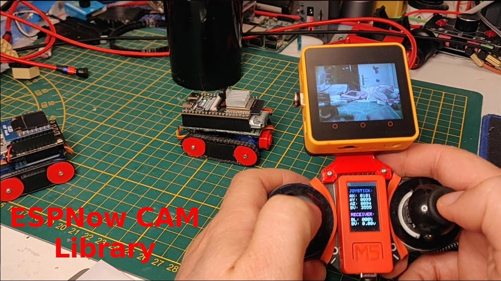

# esp32s3 camera tests

[](https://github.com/hpsaturn/esp32s3-cam/actions/)   

Basic tests and examples over ESP32S3 Cameras.

[](https://youtu.be/zXIzP1TGlpA)

## Supported devices

**Cameras:**

- [x] ESP32S3 Cam Freenove
- [x] M5CoreS3 builtin Camera

**Receivers:**

- [x] M5Core2 (AWS tested)
- [x] M5CoreS3
- [ ] Maybe any TFT with LGFX support and PSRAM

## Examples and Tests

```
 examples
 ├── core2-espnow-receiver
 │   └── Video receiver via ESPNow 
 │       (Use with freenove espnow sample)
 ├── freenove-basic
 │   └── Basic FPS and JPEG speed tester
 ├── freenove-espnow
 │   └── ESPNow camera transmitter
 ├── freenove-espnow-stats
 │   └── Basic stats via ESPNowJoystick library
 ├── freenove-webcam
 │   └── Original Freenove example with improvements
 ├── m5cores3-basic
 │   └── Basic builtin Camera/Display test
 ├── m5cores3-espnow
 │   └── ESPNow built-in camera transmitter
 ├── m5cores3-espnow-stats
 │   └── Basic stats via ESPNowJoystick library
 └── m5cores3-espnow-receiver
    └── Video receiver via ESPNow 
        (Use with freenove espnow sample)
```

## Usage and Install

Please install first [PlatformIO](http://platformio.org/) open source ecosystem for IoT development compatible with **Arduino** IDE and its command line tools (Windows, MacOs and Linux). Also, you may need to install [git](http://git-scm.com/) in your system.

For compile and install each sample, only choose one and run the next command in the root of this project, like that:

```bash
pio run -e m5cores3-espnow-receiver --target upload
```

Valid samples names are: 

```bash
freenove-espnow 
m5cores3-espnow-receiver
freenove-basic 
core2-espnow-receiver
m5cores3-espnow
freenove-webcam
freenove-espnow-stats
m5cores3-basic
```
